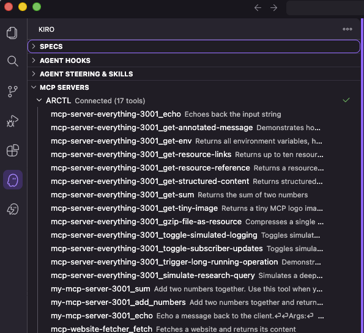
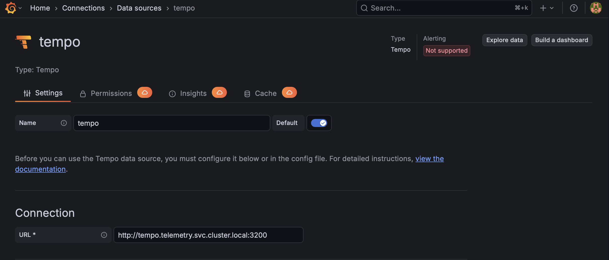
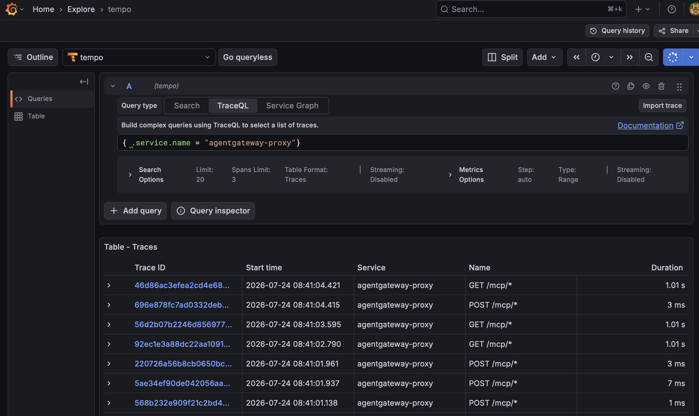

# Virtual MCP Demo

This demo shows how to federate multiple independent [Model Context Protocol (MCP)](https://modelcontextprotocol.io) servers behind a single endpoint using **Virtual MCP** on [Solo Enterprise for agentgateway](https://docs.solo.io/agentgateway/latest/mcp/virtual/).

Instead of every AI client wiring up a separate connection, URL, and credential for each MCP server, Virtual MCP multiplexes them all through one gateway endpoint. A client connects once to `/mcp` and sees the union of every tool from every backing server. Zero client-side changes are needed as servers come and go. Adding a new MCP server to the federation is as simple as adding a label to a Kubernetes Service.

---

## Architecture

```
                         ┌───────────────────────────────────────────────┐
                         │        agentgateway  (Virtual MCP)            │
   MCP client            │                                               │
   (Inspector,   ──────► │   HTTPRoute  /mcp                             │
    Kiro,    streamable  │        │                                      │
    agent)      HTTP     │        ▼                                      │
                         │   EnterpriseAgentgatewayBackend "mcp"         │
                         │        │                                      │
                         │        ├─ selector  app=mcp-server-everything │──► mcp-server-everything  (streamable HTTP)
                         │        │                                      │      └─ echo, add, printEnv, ...
                         │        ├─ static    mcp-website-fetcher       │──► mcp-website-fetcher     (SSE)
                         │        │                                      │      └─ fetch
                         │        └─ selector  app=my-mcp-server         │┈┈► my-mcp-server          (streamable HTTP)
                         │                                               │      └─ read_file, write_file, list_directory, ...
                         └───────────────────────────────────────────────┘

   One connection  ──►  one endpoint  ──►  tools from every backing MCP server
   (tools are surfaced prefixed by target name, e.g. `mcp-server-everything_echo`)
```

The single `EnterpriseAgentgatewayBackend` federates several independent servers using one config:

| Target                     | Transport        | Federation style | Distinct tools                          | Notes                                                                 |
| -------------------------- | ---------------- | ---------------- | --------------------------------------- | --------------------------------------------------------------------- |
| `mcp-server-everything`    | Streamable HTTP  | **Label selector** | `echo`, `add`, `printEnv`, …           | Selectors auto-discover any Service with the matching label.          |
| `mcp-website-fetcher`      | SSE              | **Static target**  | `fetch`                                | Label selectors only support streamable HTTP today; SSE must be static. |
| `my-mcp-server`           | Streamable HTTP  | **Label selector** | `read_file`, `write_file`, `list_directory`, … | Deployed in the Scale step to show a *different* toolset joining live. |

> **Note:** Only streamable HTTP is currently supported for label selectors. If a server speaks SSE, declare it as a `static` target.

---

## What You'll Demo

1. **Federation** — two separate MCP servers appear as one tool catalog through a single `/mcp` endpoint.
2. **Mixed transports** — streamable HTTP (via selector) and SSE (via static target) coexist in one backend.
3. **Scale by label** — deploy a second streamable-HTTP server with the right label and it joins the federation automatically, with no change to the gateway, route, or backend.
4. **Resilience** — `failureMode: FailOpen` keeps the surviving tools available even if one target is down.

---

## Prerequisites

- A Kubernetes cluster (e.g. [Kind](https://kind.sigs.k8s.io/), k3d, or any managed cluster) with `kubectl` context set
- [`helm`](https://helm.sh/docs/intro/install/) v3.x
- A **Solo Enterprise for agentgateway** license key: [request a trial](https://www.solo.io/products/agentgateway)
- [Node.js](https://nodejs.org/) 20+ (for the MCP Inspector client, run via `npx`)
- [agentregistry cli (arctl)](https://aregistry.ai/docs/quickstart/#setup)
- [Docker Engine (Docker Desktop or similar)](https://docs.docker.com/desktop/)

Set your license key:

```bash
export AGENTGATEWAY_LICENSE_KEY=<your-license-key>
```

---

## Quick Start

Run the steps in order from the repo root. Every manifest lives in [`k8s/`](k8s/).

### 1. Install the Gateway API CRDs

```bash
kubectl apply -f https://github.com/kubernetes-sigs/gateway-api/releases/download/v1.5.0/standard-install.yaml
```

### 2. Install Solo Enterprise for agentgateway

```bash
# CRDs
helm upgrade -i enterprise-agentgateway-crds \
  oci://us-docker.pkg.dev/solo-public/enterprise-agentgateway/charts/enterprise-agentgateway-crds \
  --create-namespace \
  --namespace agentgateway-system \
  --version v2026.7.0

# Control plane
helm upgrade -i enterprise-agentgateway \
  oci://us-docker.pkg.dev/solo-public/enterprise-agentgateway/charts/enterprise-agentgateway \
  -n agentgateway-system \
  --version v2026.7.0 \
  --set-string licensing.licenseKey=${AGENTGATEWAY_LICENSE_KEY}

kubectl rollout status deploy -n agentgateway-system --timeout=120s
```

### 3. Create the gateway proxy

```bash
kubectl apply -f k8s/02-gateway.yaml
kubectl get gateway agentgateway-proxy -n agentgateway-system
```

### 4. Deploy the two MCP servers

```bash
kubectl apply -f k8s/00-mcp-server-everything.yaml
kubectl apply -f k8s/01-mcp-website-fetcher.yaml
kubectl rollout status deploy/mcp-server-everything --timeout=120s
kubectl rollout status deploy/mcp-website-fetcher --timeout=120s
```

### 5. Federate them with Virtual MCP

```bash
kubectl apply -f k8s/03-virtual-mcp-backend.yaml
kubectl apply -f k8s/04-httproute.yaml
kubectl describe httproute mcp
```

### 6. Connect and verify

Port-forward the gateway:

```bash
kubectl port-forward deployment/agentgateway-proxy -n agentgateway-system 8080:80
```

In a second terminal, launch the [MCP Inspector](https://github.com/modelcontextprotocol/inspector):

```bash
npx @modelcontextprotocol/inspector@0.21.2
```

In the Inspector UI:

- **Transport:** `Streamable HTTP`
- **URL:** `http://localhost:8080/mcp`
- Click **Connect**, then open the **Tools** tab and **List Tools**.

You should see tools from _both_ servers in one list the `mcp-server-everything` tools (`echo`, `add`, `printEnv`, `longRunningOperation`, …) alongside the `fetch` tool from `mcp-website-fetcher`.

---

## Scale the Federation

Start a local agentregistry and build/publish the example MCP server in `mcp/my-mcp-server` to it. Then, load the image to your `kind` node (if using `kind`):

```bash
arctl daemon start
arctl mcp build mcp/my-mcp-server --image my-mcp-server
arctl mcp publish user/my-mcp-server --type oci --package-id my-mcp-server --description "mcp server" --version 0.1.0
kind load docker-image my-mcp-server:latest
```

```bash
kubectl apply -f k8s/05-my-mcp-server.yaml
kubectl rollout status deploy/my-mcp-server --timeout=120s
```

First click **Reconnect**, then re-run **List Tools** in the Inspector. The `my-mcp-server-*` tools now appear alongside the others, no config edit required.

---

## Kiro

To connect to the unified MCP endpoint in the Kiro IDE, add a `.kiro/settings/mcp.json` to your workspace:

```bash
mkdir -p .kiro/settings
cat <<EOF >> .kiro/settings/mcp.json
{
  "mcpServers": {
    "ARCTL": {
      "url": "http://localhost:8080/mcp"
    }
  }
}
EOF
```

Then open in Kiro:

```bash
kiro .
```

You can now see all avialable tools in the Kiro panel -> MCP servers list:



---

## Tracing

Install Tempo and Grafana:

```bash
helm repo add grafana-community https://grafana-community.github.io/helm-charts
helm upgrade --install tempo grafana-community/tempo --namespace=telemetry
helm upgrade --install grafana grafana-community/grafana --namespace=telemetry
```

Install OTEL Collector:

```bash
helm upgrade --install opentelemetry-collector-traces opentelemetry-collector \
--repo https://open-telemetry.github.io/opentelemetry-helm-charts \
--version 0.127.2 \
--set mode=deployment \
--set image.repository="otel/opentelemetry-collector-contrib" \
--set command.name="otelcol-contrib" \
--namespace=telemetry \
--create-namespace \
-f -<<EOF
config:
  receivers:
    otlp:
      protocols:
        grpc:
          endpoint: 0.0.0.0:4317
        http:
          endpoint: 0.0.0.0:4318
  exporters:
    otlp/tempo:
      endpoint: http://tempo.telemetry.svc.cluster.local:4317
      tls:
        insecure: true
    debug:
      verbosity: detailed
  service:
    pipelines:
      traces:
        receivers: [otlp]
        processors: [batch]
        exporters: [debug, otlp/tempo]
EOF
```

Verify all pods are up and running in the `telemetry` namespace:

```bash
kubectl get pods -n telemetry
```

Create an `EnterpriseAgentgatewayPolicy` to configure tracing:

```bash
kubectl apply -f- <<EOF
apiVersion: enterpriseagentgateway.solo.io/v1alpha1
kind: EnterpriseAgentgatewayPolicy
metadata:
  name: tracing
  namespace: agentgateway-system
spec:
  targetRefs:
    - kind: Gateway
      name: agentgateway-proxy
      group: gateway.networking.k8s.io
  frontend:
    tracing:
      backendRef:
        name: opentelemetry-collector-traces
        namespace: telemetry
        port: 4317
      protocol: GRPC
      clientSampling: "true"
      randomSampling: "true"
      resources:
        - name: deployment.environment.name
          expression: '"production"'
        - name: service.version
          expression: '"test"'
      attributes:
        add:
          - expression: 'request.headers["x-header-tag"]'
            name: request
          - expression: 'request.host'
            name: host
EOF
```

Next, send 10 `tools/list` calls to generate trace data:

```bash
for i in {1..10}; do npx @modelcontextprotocol/inspector@0.21.2 http://localhost:8080/mcp  --method tools/list --cli >> /dev/null; done
```

Next, get the admin password for Grafana by retrieving the `admin-password` value from the `grafana` secret in the `telemetry` namespace:

```bash
kubectl get secret -n telemetry grafana -o jsonpath='{ .data.admin-password }' | base64 -d && echo
```

Then, port-forward Grafana and access the admin UI using the password retrieved above:

```bash
kubectl port-forward svc/grafana -n telemetry 3000:80
```

```bash
open http://localhost:3000
```

Now you can add Tempo as a data source and query for traces. Add Tempo by clicking on `Connections -> Data Sources` then click to add a Tempo datasource.

Under **URL**, add this: `http://tempo.telemetry.svc.cluster.local:3200`



Finally, you can now query for trace data using the `Explore` tab. Navigate to [http://localhost:3000/explore](http://localhost:3000/explore)

Using TraceQL, you can query for traces you generated with: `{ .service.name = "agentgateway-proxy"}`



---

## Configuration

Everything is driven by [`k8s/03-virtual-mcp-backend.yaml`](k8s/03-virtual-mcp-backend.yaml).

| Field                         | Purpose                                                                                     |
| ----------------------------- | ------------------------------------------------------------------------------------------- |
| `spec.mcp.targets[].selector` | Dynamically federate every Service matching the labels (streamable HTTP only).              |
| `spec.mcp.targets[].static`   | Federate a fixed `host`/`port`/`protocol` — use this for SSE servers.                       |
| `spec.mcp.targets[].name`     | Prefix applied to that target's tools in the federated listing (e.g. `mcp-website-fetcher_fetch`). |
| `spec.mcp.failureMode`        | `FailOpen` (serve surviving targets if one is down) or `FailClosed` (fail the listing).     |

To target a different release, change `--version v2026.7.0` in the Helm commands to match your licensed version.

---

## Testing / Verification

Quick checks without the Inspector UI:

```bash
# The backend and route are accepted
kubectl get enterpriseagentgatewaybackend mcp -o yaml
kubectl describe httproute mcp

# All MCP servers are Ready
kubectl get pods -l app=mcp-server-everything
kubectl get pods -l app=mcp-website-fetcher

# Gateway is programmed
kubectl get gateway agentgateway-proxy -n agentgateway-system \
  -o jsonpath='{.status.conditions[?(@.type=="Programmed")].status}{"\n"}'
```

Test `FailOpen`: scale one target to zero, then re-list tools in the Inspector.

```bash
kubectl scale deploy/mcp-website-fetcher --replicas=0
# re-list tools; mcp-server-everything tools remain available
kubectl scale deploy/mcp-website-fetcher --replicas=1
```

---

## Cleanup

```bash
# Demo resources
kubectl delete -f k8s/05-mcp-filesystem.yaml --ignore-not-found
kubectl delete -f k8s/04-httproute.yaml --ignore-not-found
kubectl delete -f k8s/03-virtual-mcp-backend.yaml --ignore-not-found
kubectl delete -f k8s/01-mcp-website-fetcher.yaml --ignore-not-found
kubectl delete -f k8s/00-mcp-server-everything.yaml --ignore-not-found
kubectl delete -f k8s/02-gateway.yaml --ignore-not-found

# agentgateway control plane (optional — removes the whole install)
helm uninstall enterprise-agentgateway -n agentgateway-system
helm uninstall enterprise-agentgateway-crds -n agentgateway-system
kubectl delete namespace agentgateway-system
```

---

## Project Structure

```
.
├── README.md
└── k8s/
    ├── 00-mcp-server-everything.yaml     # MCP server #1 (streamable HTTP)
    ├── 01-mcp-website-fetcher.yaml       # MCP server #2 (SSE)
    ├── 02-gateway.yaml                   # agentgateway-proxy Gateway
    ├── 03-virtual-mcp-backend.yaml       # ★ Virtual MCP federation backend
    ├── 04-httproute.yaml                 # Exposes the federation at /mcp
    └── 05-my-mcp-server.yaml            # Scale-by-label demo (distinct toolset)
```

---

## Version Requirements

| Component                          | Version    |
| ---------------------------------- | ---------- |
| Solo Enterprise for agentgateway   | `v2026.7.0` |
| Kubernetes Gateway API             | `v1.5.0`   |
| MCP Inspector                      | `0.21.2`   |
| Node.js (for Inspector)            | `20+`      |

---

## References

- [Virtual MCP documentation](https://docs.solo.io/agentgateway/latest/mcp/virtual/)
- [Install Solo Enterprise for agentgateway](https://docs.solo.io/agentgateway/latest/quickstart/install/)
- [Model Context Protocol](https://modelcontextprotocol.io)
- [MCP filesystem server](https://github.com/modelcontextprotocol/servers/tree/main/src/filesystem)
- [supergateway (stdio ⇄ streamable HTTP bridge)](https://github.com/supercorp-ai/supergateway)
