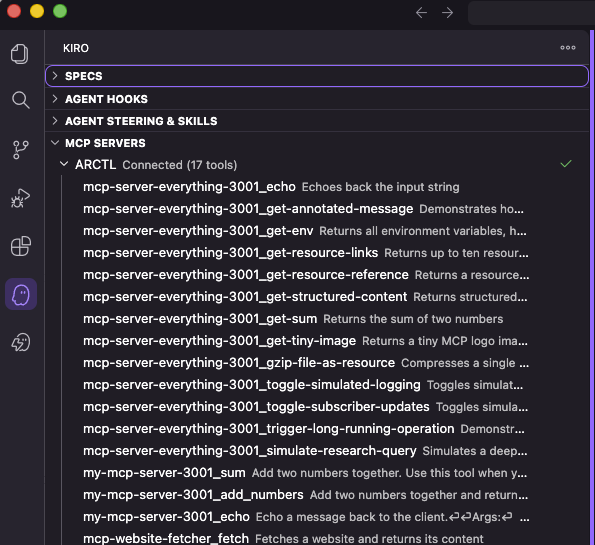
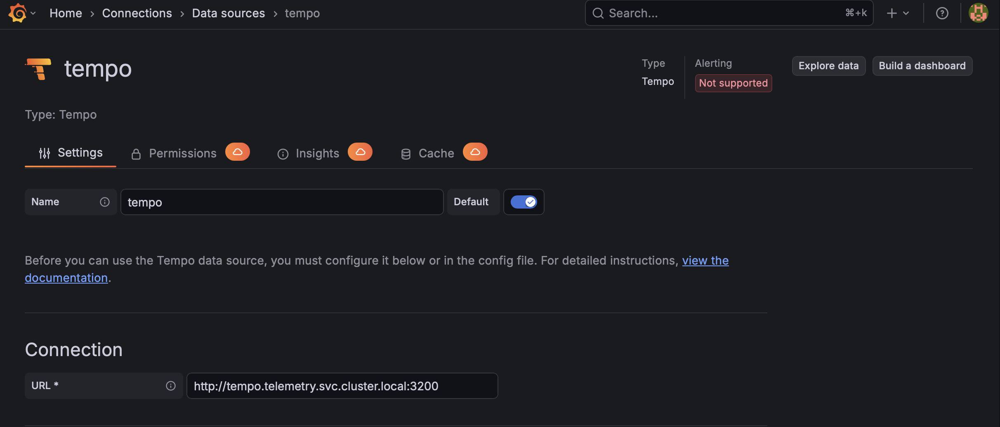
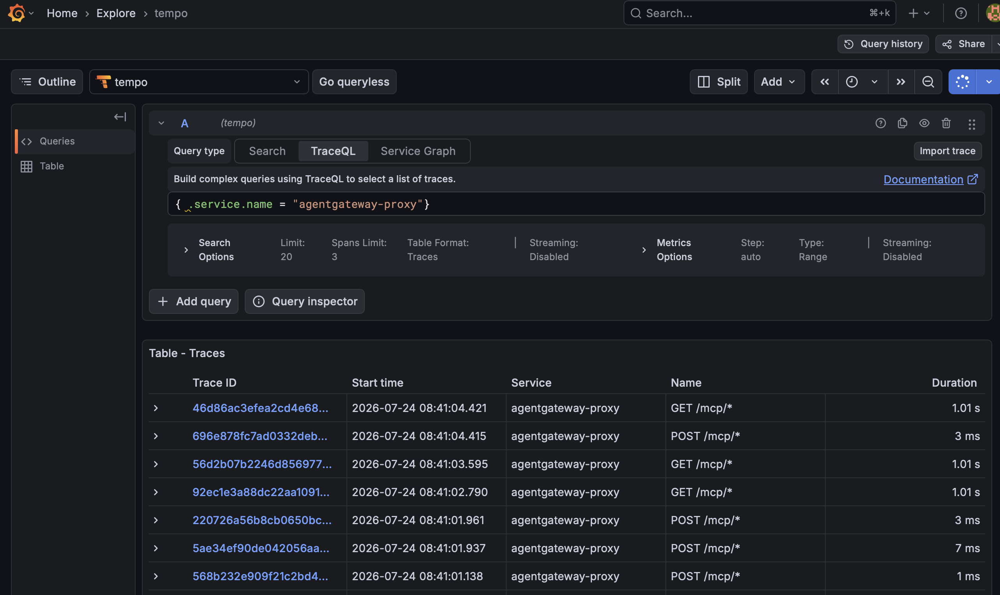

# Virtual MCP Demo

This demo shows how to federate multiple independent [Model Context Protocol (MCP)](https://modelcontextprotocol.io) servers behind a single endpoint using **Virtual MCP** on [Solo Enterprise for agentgateway](https://docs.solo.io/agentgateway/latest/mcp/virtual/).

Instead of every AI client wiring up a separate connection, URL, and credential for each MCP server, Virtual MCP multiplexes them all through one gateway endpoint. A client connects once to `/mcp` and sees the union of every tool from every backing server. Zero client-side changes are needed as servers come and go. Adding a new MCP server to the federation is as simple as adding a label to a Kubernetes Service.

---

## Architecture

```
                         ┌───────────────────────────────────────────────┐
                         │        agentgateway  (Virtual MCP)            │
   MCP client            │                                               │
   (Inspector,   ──────► │   HTTPRoute  /mcp                             │
    Kiro,    streamable  │        │  ▲ jwtAuthentication (Entra ID)      │
    agent)      HTTP     │        ▼                                      │
                         │   EnterpriseAgentgatewayBackend "mcp"         │
                         │        │  ▲ mcp.authorization (tool filter)   │
                         │        │                                      │
                         │        ├─ selector  type=mcp-server           │──► mcp-server-everything  (streamable HTTP)
                         │        │                                      │      └─ echo, get-sum, get-env, ...
                         │        ├─ static    mcp-website-fetcher       │──► mcp-website-fetcher     (SSE)
                         │        │                                      │      └─ fetch
                         │        └─ selector  type=mcp-server           │┈┈► my-mcp-server          (streamable HTTP)
                         │                                               │      └─ read_file, write_file, list_directory, ...
                         └───────────────────────────────────────────────┘

   One connection  ──►  one endpoint  ──►  tools from every backing MCP server
   (selector-discovered tools are prefixed `<service>-<port>_`, e.g.
    `mcp-server-everything-3001_echo`; static targets use the declared name,
    e.g. `mcp-website-fetcher_fetch`)
```

The single `EnterpriseAgentgatewayBackend` federates several independent servers using one config:

| Target                     | Transport        | Federation style | Distinct tools                          | Notes                                                                 |
| -------------------------- | ---------------- | ---------------- | --------------------------------------- | --------------------------------------------------------------------- |
| `mcp-server-everything`    | Streamable HTTP  | **Label selector** | `echo`, `add`, `printEnv`, …           | Selectors auto-discover any Service with the matching label.          |
| `mcp-website-fetcher`      | SSE              | **Static target**  | `fetch`                                | Label selectors only support streamable HTTP today; SSE must be static. |
| `my-mcp-server`           | Streamable HTTP  | **Label selector** | `read_file`, `write_file`, `list_directory`, … | Deployed in the Scale step to show a *different* toolset joining live. |

> **Note:** Only streamable HTTP is currently supported for label selectors. If a server speaks SSE, declare it as a `static` target.

---

## What You'll Demo

1. **Federation** — two separate MCP servers appear as one tool catalog through a single `/mcp` endpoint.
2. **Mixed transports** — streamable HTTP (via selector) and SSE (via static target) coexist in one backend.
3. **Scale by label** — deploy a second streamable-HTTP server with the right label and it joins the federation automatically, with no change to the gateway, route, or backend.
4. **Resilience** — `failureMode: FailOpen` keeps the surviving tools available even if one target is down.
5. **Per-identity tool filtering** — an `EnterpriseAgentgatewayPolicy` gives each caller a different tool catalog from the same `/mcp` URL, keyed on Microsoft Entra ID app roles and enforced at the gateway.
6. **Backend auth with a consent screen** — the gateway logs the user in with Entra, shows a branded authorization challenge, then runs a *second* OAuth flow with the remote Atlassian MCP server and holds that token on the user's behalf. The client never handles an Atlassian credential.

---

## Prerequisites

- A Kubernetes cluster (e.g. [Kind](https://kind.sigs.k8s.io/), k3d, or any managed cluster) with `kubectl` context set
- [`helm`](https://helm.sh/docs/intro/install/) v3.x
- A **Solo Enterprise for agentgateway** license key: [request a trial](https://www.solo.io/products/agentgateway)
- [Node.js](https://nodejs.org/) 20+ (for the MCP Inspector client, run via `npx`)
- [agentregistry cli (arctl)](https://aregistry.ai/docs/quickstart/#setup)
- [Docker Engine (Docker Desktop or similar)](https://docs.docker.com/desktop/)

For the [tool filtering](#filter-tools-by-identity-microsoft-entra-id) section only:

- `envsubst` (`brew install gettext`) to substitute IDs into the Entra manifests
- [`az` CLI](https://learn.microsoft.com/cli/azure/install-azure-cli) to mint test tokens.
- A Microsoft Entra ID tenant with permission to create an app registration

For the [backend auth](#backend-auth-for-a-remote-mcp-server-atlassian) section only:

- Solo Enterprise for agentgateway `v2026.8.0` or later
- An Atlassian Cloud account with Jira and/or Confluence access

Set your license key:

```bash
export AGENTGATEWAY_LICENSE_KEY=<your-license-key>
```

---

## Quick Start

Run the steps in order from the repo root. Every manifest lives in [`k8s/`](k8s/).

### 1. Install the Gateway API CRDs

```bash
kubectl apply -f https://github.com/kubernetes-sigs/gateway-api/releases/download/v1.5.0/standard-install.yaml
```

### 2. Install Solo Enterprise for agentgateway

```bash
# CRDs
helm upgrade -i enterprise-agentgateway-crds \
  oci://us-docker.pkg.dev/solo-public/enterprise-agentgateway/charts/enterprise-agentgateway-crds \
  --create-namespace \
  --namespace agentgateway-system \
  --version v2026.8.0

# Control plane
helm upgrade -i enterprise-agentgateway \
  oci://us-docker.pkg.dev/solo-public/enterprise-agentgateway/charts/enterprise-agentgateway \
  -n agentgateway-system \
  --version v2026.8.0 \
  --set-string licensing.licenseKey=${AGENTGATEWAY_LICENSE_KEY}

kubectl rollout status deploy -n agentgateway-system --timeout=120s
```

### 3. Create the gateway proxy

```bash
kubectl apply -f k8s/02-gateway.yaml
kubectl get gateway agentgateway-proxy -n agentgateway-system
```

### 4. Deploy the two MCP servers

```bash
kubectl apply -f k8s/00-mcp-server-everything.yaml
kubectl apply -f k8s/01-mcp-website-fetcher.yaml
kubectl rollout status deploy/mcp-server-everything --timeout=120s
kubectl rollout status deploy/mcp-website-fetcher --timeout=120s
```

### 5. Federate them with Virtual MCP

```bash
kubectl apply -f k8s/03-virtual-mcp-backend.yaml
kubectl apply -f k8s/04-httproute.yaml
kubectl describe httproute mcp
```

### 6. Connect and verify

Port-forward the gateway:

```bash
kubectl port-forward deployment/agentgateway-proxy -n agentgateway-system 8080:80
```

In a second terminal, launch the [MCP Inspector](https://github.com/modelcontextprotocol/inspector):

```bash
npx @modelcontextprotocol/inspector@0.21.2
```

In the Inspector UI:

- **Transport:** `Streamable HTTP`
- **URL:** `http://localhost:8080/mcp`
- Click **Connect**, then open the **Tools** tab and **List Tools**.

You should see tools from _both_ servers in one list the `mcp-server-everything` tools (`echo`, `add`, `printEnv`, `longRunningOperation`, …) alongside the `fetch` tool from `mcp-website-fetcher`.

---

## Scale the Federation

Start a local agentregistry and build/publish the example MCP server in `mcp/my-mcp-server` to it. Then, load the image to your `kind` node (if using `kind`):

```bash
arctl daemon start
arctl mcp build mcp/my-mcp-server --image my-mcp-server
arctl mcp publish user/my-mcp-server --type oci --package-id my-mcp-server --description "mcp server" --version 0.1.0
kind load docker-image my-mcp-server:latest
```

```bash
kubectl apply -f k8s/05-my-mcp-server.yaml
kubectl rollout status deploy/my-mcp-server --timeout=120s
```

First click `Reconnect`, then re-run `List Tools` in the Inspector. The `my-mcp-server-*` tools now appear alongside the others, no config edit required.

---

## Filter Tools by Identity (Microsoft Entra ID)

You can attach an MCP `EnterpriseAgentgatewayPolicy` policy to the Virtual MCP backend to filter the tool catalog per-client, computed from the claims in their token.

Filtering is enforced on both sides of the protocol:

| Method       | Behavior for a disallowed tool                                            |
| ------------ | ------------------------------------------------------------------------- |
| `tools/list` | Tools that the client does not have access to see are filtered from the returned list.         |
| `tools/call` | Calls to a disallowed tool fail with `-32602 Unknown tool`. The existence of the tool is not leaked by the error.   |

Rules are CEL expressions in `spec.backend.mcp.authorization.policy.matchExpressions`. A tool is served if at least one expression matches. Any non-matched tools are not served (no implicit allow).

### Available CEL variables

| Variable            | Contains                                                                 |
| ------------------- | ------------------------------------------------------------------------ |
| `mcp.tool.name`     | The tool name.                               |
| `mcp.tool.target`   | The federated target the tool came from.         |
| `mcp.prompt.name`   | Prompt name, for filtering `prompts/*`.                                  |
| `mcp.resource.name` | Resource name, for filtering `resources/*`.                              |
| `jwt.<claim>`       | Any claim from the validated token (eg `jwt.sub`, `jwt.roles`, `jwt.groups`). Guard with `has()`. |

> **Note that `mcp.tool.name` is the base tool name, not the client-visible one returned from the gateway (eg `echo`, not `mcp-server-everything-3001_echo`)**

> **Note that Entra outputs jwt.groups as GUIDs, not names**

> **Note that `mcp.tool.target` differs based on target type**
> - For a `static` target it is the `name` from the backend spec (`mcp-website-fetcher`).
> - For a `selector` target, agentgateway discovers one target per matching Service and names it `<service>-<port>`.
>   - The target declared as `mcp-servers` in [`k8s/03-virtual-mcp-backend.yaml`](k8s/03-virtual-mcp-backend.yaml) for example would be: `mcp-server-everything-3001`
> - Matching `mcp.tool.target == "mcp-servers"` matches nothing and silently filters out every tool. Read the real names off the tool prefixes in a `tools/list` response before writing selector-based rules.

### Step 1 — Create an anonymous filter

```bash
kubectl apply -f k8s/06-tool-filter-anonymous.yaml
```

Within Inspector, run `List Tools` (click `Reconnect` first), or from the CLI:

```bash
npx @modelcontextprotocol/inspector@0.21.2 http://localhost:8080/mcp --method tools/list --cli
```

The catalog drops from 14 tools to 3: two allowed by name plus the whole `mcp-website-fetcher` target:

```
mcp-server-everything-3001_echo
mcp-server-everything-3001_get-sum
mcp-website-fetcher_fetch
```

`get-sum` still works, but `get-env` is refused:

```bash
# allowed
npx @modelcontextprotocol/inspector@0.21.2 http://localhost:8080/mcp \
  --method tools/call --tool-name mcp-server-everything-3001_get-sum \
  --tool-arg a=2 --tool-arg b=3 --cli

# {"code":-32602,"message":"Unknown tool: ..."}
npx @modelcontextprotocol/inspector@0.21.2 http://localhost:8080/mcp \
  --method tools/call --tool-name mcp-server-everything-3001_get-env --cli
```

### Step 2 — Register the API in Microsoft Entra ID

To key the rules on identity, the gateway needs tokens to validate. In the [Azure portal](https://portal.azure.com):

1. `App registrations → New registration.` Name it (e.g. `virtual-mcp`). Leave redirect URIs empty.
2. Copy the `Application (client) ID` and `Directory (tenant) ID`.
3. `Expose an API → Add a scope.` Accept the default App ID URI (`api://<client-id>`), then add a scope named `mcp_access`. Set `Who can consent` to *Admins and users*.
4. `App roles → Create app role` for each tier, allowed member types `Users/Groups`:

   | Display name | Value         | Grants                              |
   | ------------ | ------------- | ----------------------------------- |
   | Tools Read   | `Tools.Read`  | `echo`, `get-sum`, and every `get-*` tool |
   | Web Read     | `Web.Read`    | the whole `mcp-website-fetcher` target |
   | Tools Admin  | `Tools.Admin` | the entire federated catalog         |

5. `Enterprise applications → your app → Users and groups`: assign users or groups to those roles. Start with `Tools.Read` only, so the filtering is visibly partial rather than all-or-nothing.
  - You can change the role attached to your user here to test the different policy filters in Step 4.
6. `Expose an API → Add a client application`: pre-authorize the clients allowed to request `mcp_access` without a consent prompt. 
  - Note that the Azure CLI must be added here for the `az` command in Step 4 to work: `04b07795-8ddb-461a-bbee-02f9e1bf7b46`

### Step 3 — Wire Entra into the gateway

```bash
export ENTRA_TENANT_ID=<directory (tenant) ID>
export ENTRA_CLIENT_ID=<application (client) ID>
```

The gateway has to fetch Entra's signing keys, so add Microsoft's login endpoint as a static `AgentgatewayBackend`:

```bash
kubectl apply -f k8s/07-entra-jwks-backend.yaml
```

Then attach JWT authentication to the `HTTPRoute`:

```bash
envsubst < k8s/08-mcp-entra-authn.yaml | kubectl apply -f -
```

The `mcp` block in that policy also publishes an OAuth 2.0 Protected Resource Metadata document (RFC 9728), so MCP clients discover Entra and run the login flow on their own.

> **NOTE**: Entra issues **v1.0** access tokens by default, whose `iss` is `https://sts.windows.net/<tenant>/` (with a trailing slash included). If you set `"accessTokenAcceptedVersion": 2` in the app manifest, change the issuer to `https://login.microsoftonline.com/<tenant>/v2.0`. The v2.0 keys endpoint serves signing keys for both versions, so `jwksPath` is the same either way.

### Step 4 — Swap in role-based tool filtering

```bash
kubectl apply -f k8s/09-mcp-tool-authz.yaml
```

This reuses the policy name from Step 1, so it replaces the anonymous rules with ones that read `jwt.roles`:

```yaml
matchExpressions:
  - 'has(jwt.roles) && "Tools.Read" in jwt.roles && mcp.tool.name in ["echo", "get-sum"]'
  - 'has(jwt.roles) && "Web.Read" in jwt.roles && mcp.tool.target == "mcp-website-fetcher"'
  - 'has(jwt.roles) && "Tools.Read" in jwt.roles && mcp.tool.name.startsWith("get-")'
  - 'has(jwt.roles) && "Tools.Admin" in jwt.roles'
```

Confirm the policy attached and its CEL compiled. The `reason` field must be `Valid`:

```bash
kubectl get enterpriseagentgatewaypolicy mcp-tool-filter \
  -o jsonpath='{range .status.ancestors[0].conditions[*]}{.type}={.status} reason={.reason} msg={.message}{"\n"}{end}'
```

With Step 3 applied, an unauthenticated caller is rejected before filtering:

```bash
npx @modelcontextprotocol/inspector@0.21.2 http://localhost:8080/mcp --method tools/list --cli
# {"error":"unauthorized","error_description":"JWT token required"}
```

Next, issue a token with the `az` CLI and include it in the `tools/list` call:

```bash
export TOKEN=$(az account get-access-token --resource api://${ENTRA_CLIENT_ID} --query accessToken -o tsv)

npx @modelcontextprotocol/inspector@0.21.2 http://localhost:8080/mcp \
  --header "Authorization: Bearer ${TOKEN}" --method tools/list --cli
```

You should see the list of filtered tools allowed by the `Tools.Read` role:

```bash
mcp-server-everything-3001_echo
mcp-server-everything-3001_get-annotated-message
mcp-server-everything-3001_get-env
mcp-server-everything-3001_get-resource-links
mcp-server-everything-3001_get-resource-reference
mcp-server-everything-3001_get-structured-content
mcp-server-everything-3001_get-sum
mcp-server-everything-3001_get-tiny-image
```

---

## Backend Auth for a Remote MCP Server (Atlassian)

Everything so far protects the *front* door: the gateway checks who the caller is and which tools they may see. Backend auth solves the other half. When the MCP server itself is a third-party SaaS that wants its own OAuth token — like Atlassian's hosted MCP server — the gateway obtains that token *on the user's behalf* and attaches it upstream. The MCP client never sees, stores, or refreshes an Atlassian credential.

The result is a **dual OAuth** flow with an organizational checkpoint in the middle:

```
   MCP client                agentgateway                    Entra ID      Atlassian
       │                          │                              │             │
       │──── connect /mcp/atlassian ─►│                          │             │
       │◄─── 401 + RFC 9728 metadata ─┤  (points at /oauth-issuer)│            │
       │                          │                              │             │
       │──── authorize ──────────►│─── leg 1: downstream ───────►│             │
       │                          │◄── id/access token ──────────┤             │
       │                          │                                            │
       │                     ┌────┴─────────────────┐                          │
       │                     │  CONSENT SCREEN      │  gateway-hosted, branded │
       │                     │  "Allow / Deny"      │  per backend             │
       │                     └────┬─────────────────┘                          │
       │                          │                                            │
       │                          │─── leg 2: upstream OAuth ─────────────────►│
       │                          │◄── access + refresh token ─────────────────┤
       │◄─── gateway token ───────┤   stored against the user's Entra identity │
       │                          │                                            │
       │──── tools/call ─────────►│─── + Atlassian token ─────────────────────►│
```

Leg 1 is the Entra login you already configured. Leg 2 is new, and so is the consent screen between them: a gateway-rendered "Acme wants to read your Jira issues" challenge that is *yours*, not Atlassian's. The gateway records the grant keyed on the user's downstream identity plus the backend they authorized, and reuses it until the upstream refresh token expires.

> This section follows the [MCP consent screen guide](https://docs.solo.io/agentgateway/latest/mcp/token-exchange/elicitations/consent-screen/), with Microsoft Entra ID in place of Keycloak as the downstream IdP. It needs **`v2026.8.0`** or later, and it exposes a *second* MCP endpoint at `/mcp/atlassian` — the federated `/mcp` endpoint from the earlier steps is untouched.

### Step 1 — Make the Entra app usable as an OAuth client

The gateway's OAuth issuer proxy is a confidential OAuth client (the equivalent of the guide's `agw-issuer` Keycloak client). The simplest path is to reuse the **same app registration** from the tool-filtering section as both the protected API and the issuer client — Entra lets a client request its own API scope, so no second registration or pre-authorization is needed. In the [Azure portal](https://portal.azure.com), on that app:

1. `Authentication → Add a platform → Web`, redirect URI `http://localhost:8080/oauth-issuer/callback/downstream`
   - Entra only allows plain `http` for `localhost`. If your gateway is reachable at a load-balancer address instead of a port-forward, that address must be **HTTPS**.
2. `Certificates & secrets → New client secret.` Copy the **value** — it is only shown once.

Or with the `az` CLI:

```bash
az ad app update --id <application (client) ID> \
  --web-redirect-uris "http://localhost:8080/oauth-issuer/callback/downstream"
```

Export everything the manifests need:

```bash
export ENTRA_TENANT_ID=<directory (tenant) ID>          # same tenant as before
export ENTRA_CLIENT_ID=<application (client) ID>        # the app from the previous section
export ISSUER_CLIENT_ID=${ENTRA_CLIENT_ID}              # same app doing double duty
export ISSUER_CLIENT_SECRET=<the client secret value>

# Where the browser and MCP client reach the gateway. With the port-forward from
# the Quick Start this is localhost:8080; otherwise use your LB address.
export GW_ADDRESS=localhost:8080
```

> For a production-shaped setup, register the issuer as its **own** confidential app instead, grant it delegated `mcp_access` with admin consent, and pre-authorize it under `Expose an API → Add a client application` on the API app. Then `ISSUER_CLIENT_ID` is that app rather than `ENTRA_CLIENT_ID`.

No Atlassian registration is needed. The gateway uses **dynamic client registration** against Atlassian for the upstream leg.

### Step 2 — Turn on the STS and the OAuth issuer proxy

Backend auth needs two things the Quick Start install doesn't have: the Security Token Service that stores per-user upstream tokens, and the controller's OAuth issuer configured against Entra. Both live in [`helm/enterprise-agentgateway-values.yaml`](helm/enterprise-agentgateway-values.yaml):

```bash
envsubst < helm/enterprise-agentgateway-values.yaml > /tmp/agw-values.yaml

helm upgrade -i enterprise-agentgateway-crds \
  oci://us-docker.pkg.dev/solo-public/enterprise-agentgateway/charts/enterprise-agentgateway-crds \
  -n agentgateway-system \
  --version v2026.8.0

helm upgrade -i enterprise-agentgateway \
  oci://us-docker.pkg.dev/solo-public/enterprise-agentgateway/charts/enterprise-agentgateway \
  -n agentgateway-system \
  --version v2026.8.0 \
  -f /tmp/agw-values.yaml

kubectl rollout status deploy -n agentgateway-system --timeout=180s
```

The `consent` block in those values is the **default** branding for every backend:

| Field           | Purpose                                                                    |
| --------------- | -------------------------------------------------------------------------- |
| `enabled`       | Renders the consent screen at all.                                          |
| `force_refresh` | `true` re-prompts on every flow; `false` reuses the grant until token expiry. |
| `platform_name` | The name shown on the screen — your org, not the backend's.                 |
| `logo_url`      | Optional branding image.                                                    |
| `legal_text`    | Compliance copy shown above the Allow button.                               |

### Step 3 — Wire the STS into the gateway proxy

The proxy needs to know where to exchange tokens. This re-applies the Gateway from Step 3 of the Quick Start with a `parametersRef` added:

```bash
kubectl apply -f k8s/10-agw-params.yaml
kubectl rollout status deploy/agentgateway-proxy -n agentgateway-system --timeout=120s
```

### Step 4 — Route to the OAuth issuer

The consent screen and both OAuth callbacks are served by the controller on port `7777`. Publish them through the data plane so the browser can reach them at the same address as the MCP endpoint:

```bash
kubectl apply -f k8s/11-oauth-issuer-route.yaml
```

### Step 5 — Add the Atlassian backend and its auth

```bash
# Remote MCP server + downstream (Entra) authentication + RFC 9728 metadata
envsubst < k8s/12-mcp-atlassian-backend.yaml | kubectl apply -f -

# Upstream (Atlassian) OAuth leg + per-backend consent overrides
kubectl apply -f k8s/13-mcp-atlassian-elicit.yaml

# Expose it at /mcp/atlassian
kubectl apply -f k8s/14-mcp-atlassian-httproute.yaml
```

The JWKS backend from the tool-filtering section (`k8s/07-entra-jwks-backend.yaml`) is reused for token validation, so apply that first if you skipped it.

Two values in the upstream config are easy to get wrong, and both fail loudly:

- **`baseUrl` must be `https://cf.mcp.atlassian.com`,** not `https://mcp.atlassian.com`. Atlassian serves its authorization-server metadata from both hosts but declares `"issuer": "https://cf.mcp.atlassian.com"` in each. The gateway requires `baseUrl` to equal that issuer and refuses the flow otherwise, with `/oauth-issuer/authorize` returning `500 {"error":"server_error"}` and this in the controller log:

  ```
  failed to start auth flow ... unknown resource: authorization server metadata
  issuer "https://cf.mcp.atlassian.com" does not match base_url "https://mcp.atlassian.com"
  ```

- **The upstream target path is `/v1/mcp`** (Atlassian's streamable-HTTP endpoint; `/v1/sse` is the SSE one). `mcpResourcePath: /mcp/atlassian` in the policy is the path *on the gateway* — a different thing — and using it upstream gets a 404 from Atlassian.

Two more things differ from the Keycloak version of the guide, both because of how Entra scopes tokens:

- **Audience.** Keycloak can mint a token audienced to an arbitrary resource URL, so the guide uses `http://<gateway>/mcp/atlassian`. Entra scopes the audience to the API's App ID URI, so `12-mcp-atlassian-backend.yaml` validates `api://${ENTRA_CLIENT_ID}` instead — matching the provider already configured in `08-mcp-entra-authn.yaml`.
- **Issuer.** Entra issues v1.0 tokens by default (`https://sts.windows.net/<tenant>/`). Set `"accessTokenAcceptedVersion": 2` in the app manifest and it becomes `https://login.microsoftonline.com/<tenant>/v2.0`. The JWKS path is the same either way.

The `agentgateway.dev/issuer-proxy` annotation on `resourceMetadata` is the load-bearing part: it makes MCP clients start their login at the gateway's issuer rather than at Entra directly, which is what gives the gateway a place to insert the consent screen and leg 2.

### Step 6 — Walk the flow

```bash
kubectl port-forward deployment/agentgateway-proxy -n agentgateway-system 8080:80
npx @modelcontextprotocol/inspector@0.21.2
```

In the Inspector UI:

- **Transport:** `Streamable HTTP`
- **URL:** `http://localhost:8080/mcp/atlassian`
- Click **Connect**.

You should be walked through, in order:

1. **Entra login** — the downstream leg, in a browser tab.
2. **The gateway consent screen** — your branding, Atlassian's logo and legal text from `13-mcp-atlassian-elicit.yaml`.
3. **Atlassian's own OAuth consent** — the upstream leg, requesting `read:jira-work` and `read:confluence-content.summary`.

After that the Atlassian tools list and call successfully. Reconnect and the consent screen doesn't reappear — the grant is cached against your Entra identity until the Atlassian refresh token expires. Set `force_refresh: true` in the Helm values to prompt every time.

### Opting a backend out of consent

Consent is per-backend. An internal MCP server that doesn't need an organizational checkpoint can skip it while keeping the upstream OAuth leg:

```yaml
chainedAuth:
  oauth:
    baseUrl: https://mcp.internal.example.com
    scopes: [openid, profile]
    clientName: Internal Tools
    consent:
      disabled: true
```

---

## Kiro

To connect to the unified MCP endpoint in the Kiro IDE, add a `.kiro/settings/mcp.json` to your workspace:

```bash
mkdir -p .kiro/settings
cat <<EOF >> .kiro/settings/mcp.json
{
  "mcpServers": {
    "ARCTL": {
      "url": "http://localhost:8080/mcp"
    }
  }
}
EOF
```

Then open in Kiro:

```bash
kiro .
```

You can now see all avialable tools in the Kiro panel -> MCP servers list:



---

## Tracing

Install Tempo and Grafana:

```bash
helm repo add grafana-community https://grafana-community.github.io/helm-charts
kubectl create namespace telemetry
helm upgrade --install tempo grafana-community/tempo --namespace=telemetry
helm upgrade --install grafana grafana-community/grafana --namespace=telemetry
```

Install OTEL Collector:

```bash
helm upgrade --install opentelemetry-collector-traces opentelemetry-collector \
--repo https://open-telemetry.github.io/opentelemetry-helm-charts \
--version 0.127.2 \
--set mode=deployment \
--set image.repository="otel/opentelemetry-collector-contrib" \
--set command.name="otelcol-contrib" \
--namespace=telemetry \
--create-namespace \
-f -<<EOF
config:
  receivers:
    otlp:
      protocols:
        grpc:
          endpoint: 0.0.0.0:4317
        http:
          endpoint: 0.0.0.0:4318
  exporters:
    otlp/tempo:
      endpoint: http://tempo.telemetry.svc.cluster.local:4317
      tls:
        insecure: true
    debug:
      verbosity: detailed
  service:
    pipelines:
      traces:
        receivers: [otlp]
        processors: [batch]
        exporters: [debug, otlp/tempo]
EOF
```

Verify all pods are up and running in the `telemetry` namespace:

```bash
kubectl get pods -n telemetry
```

Create an `EnterpriseAgentgatewayPolicy` to configure tracing:

```bash
kubectl apply -f- <<EOF
apiVersion: enterpriseagentgateway.solo.io/v1alpha1
kind: EnterpriseAgentgatewayPolicy
metadata:
  name: tracing
  namespace: agentgateway-system
spec:
  targetRefs:
    - kind: Gateway
      name: agentgateway-proxy
      group: gateway.networking.k8s.io
  frontend:
    tracing:
      backendRef:
        name: opentelemetry-collector-traces
        namespace: telemetry
        port: 4317
      protocol: GRPC
      clientSampling: "true"
      randomSampling: "true"
      resources:
        - name: deployment.environment.name
          expression: '"production"'
        - name: service.version
          expression: '"test"'
      attributes:
        add:
          - expression: 'request.headers["x-header-tag"]'
            name: request
          - expression: 'request.host'
            name: host
EOF
```

Next, send 10 `tools/list` calls to generate trace data:

```bash
for i in {1..10}; do npx @modelcontextprotocol/inspector@0.21.2 http://localhost:8080/mcp  --method tools/list --cli >> /dev/null; done
```

Next, get the admin password for Grafana by retrieving the `admin-password` value from the `grafana` secret in the `telemetry` namespace:

```bash
kubectl get secret -n telemetry grafana -o jsonpath='{ .data.admin-password }' | base64 -d && echo
```

Then, port-forward Grafana and access the admin UI using the password retrieved above:

```bash
kubectl port-forward svc/grafana -n telemetry 3000:80
```

```bash
open http://localhost:3000
```

Now you can add Tempo as a data source and query for traces. Add Tempo by clicking on `Connections -> Data Sources` then click to add a Tempo datasource.

Under **URL**, add this: `http://tempo.telemetry.svc.cluster.local:3200`



Finally, you can now query for trace data using the `Explore` tab. Navigate to [http://localhost:3000/explore](http://localhost:3000/explore)

Using TraceQL, you can query for traces you generated with: `{ .service.name = "agentgateway-proxy"}`



---

## Configuration

Everything is driven by [`k8s/03-virtual-mcp-backend.yaml`](k8s/03-virtual-mcp-backend.yaml).

| Field                         | Purpose                                                                                     |
| ----------------------------- | ------------------------------------------------------------------------------------------- |
| `spec.mcp.targets[].selector` | Dynamically federate every Service matching the labels (streamable HTTP only).              |
| `spec.mcp.targets[].static`   | Federate a fixed `host`/`port`/`protocol`. Use this for SSE servers.                       |
| `spec.mcp.targets[].name`     | Prefix applied to that target's tools in the federated listing (e.g. `mcp-website-fetcher_fetch`). |
| `spec.mcp.failureMode`        | `FailOpen` (serve surviving targets if one is down) or `FailClosed` (fail the listing).     |

Tool filtering and authentication are driven by `EnterpriseAgentgatewayPolicy`:

| Field                                                | Purpose                                                                                  |
| ---------------------------------------------------- | ---------------------------------------------------------------------------------------- |
| `spec.backend.mcp.authorization.policy.matchExpressions` | CEL rules, OR'd, selecting which tools/prompts/resources a caller may see and call.   |
| `spec.backend.mcp.authorization.action`               | `Allow` (default), `Deny`, or `Require`.                                                 |
| `spec.traffic.jwtAuthentication.providers[]`          | Token issuer, audiences, and JWKS source. Attach to the `HTTPRoute`.  |
| `spec.traffic.jwtAuthentication.mcp.resourceMetadata` | Publishes RFC 9728 Protected Resource Metadata so MCP clients can discover the IdP.      |

Backend auth is split between the Helm values and a policy on the backend:

| Field                                                     | Purpose                                                                                     |
| --------------------------------------------------------- | -------------------------------------------------------------------------------------------- |
| `controller.extraEnv.KGW_OAUTH_ISSUER_CONFIG`             | The gateway's OAuth issuer proxy: its public base URL, the downstream IdP, and consent defaults. |
| `tokenExchange.*`                                         | The STS that stores per-user upstream tokens and validates the downstream token being exchanged. |
| `spec.backend.entElicitation.brokered.chainedAuth.oauth`  | The upstream OAuth leg — the remote MCP server's base URL, scopes, and client name.          |
| `...chainedAuth.oauth.consent`                            | Per-backend consent overrides (`logoUrl`, `legalText`, `disabled`).                          |
| `spec.backend.entTokenExchange.solo.elicitation`          | Attaches the elicited token to upstream calls.                                               |
| `policies.mcp.authentication.resourceMetadata['agentgateway.dev/issuer-proxy']` | Routes client login through the gateway's issuer instead of straight to the IdP. |

To target a different release, change `--version v2026.8.0` in the Helm commands to match your licensed version.

---

## Testing / Verification

Quick checks without the Inspector UI:

```bash
# The backend and route are accepted
kubectl get enterpriseagentgatewaybackend mcp -o yaml
kubectl describe httproute mcp

# All MCP servers are Ready
kubectl get pods -l app=mcp-server-everything
kubectl get pods -l app=mcp-website-fetcher

# Gateway is programmed
kubectl get gateway agentgateway-proxy -n agentgateway-system \
  -o jsonpath='{.status.conditions[?(@.type=="Programmed")].status}{"\n"}'
```

Test `FailOpen`: scale one target to zero, then re-list tools in the Inspector.

```bash
kubectl scale deploy/mcp-website-fetcher --replicas=0
# re-list tools; mcp-server-everything tools remain available
kubectl scale deploy/mcp-website-fetcher --replicas=1
```

Check tool-filtering policies:

```bash
# Policy attached and CEL compiled? reason must be Valid -- PartiallyValid means
# at least one matchExpression failed to compile and is being ignored.
kubectl get enterpriseagentgatewaypolicy mcp-tool-filter \
  -o jsonpath='{range .status.ancestors[0].conditions[*]}{.type}={.status} reason={.reason} msg={.message}{"\n"}{end}'

# Discover the real mcp.tool.target names from the tool prefixes
npx @modelcontextprotocol/inspector@0.21.2 http://localhost:8080/mcp --method tools/list --cli \
  | grep '"name"'
```

Check backend auth:

```bash
# The client's entry point -- must list the gateway itself as the auth server
curl -s http://localhost:8080/.well-known/oauth-protected-resource/mcp/atlassian | jq

# The issuer proxy is reachable through the data plane
curl -s -o /dev/null -w '%{http_code}\n' http://localhost:8080/oauth-issuer/.well-known/oauth-authorization-server

# Elicitation policy accepted
kubectl get enterpriseagentgatewaypolicy mcp-atlassian-elicit -n agentgateway-system \
  -o jsonpath='{range .status.ancestors[0].conditions[*]}{.type}={.status} reason={.reason} msg={.message}{"\n"}{end}'

# The proxy picked up the STS env from the parametersRef
kubectl get deploy agentgateway-proxy -n agentgateway-system \
  -o jsonpath='{.spec.template.spec.containers[0].env[?(@.name=="STS_URI")].value}{"\n"}'
```

The most useful check before opening a browser is to drive `/authorize` directly. A `302` to `login.microsoftonline.com` means the whole chain — issuer config, Entra client, and Atlassian metadata discovery — is sound. A `500` means the upstream leg failed; the reason is in the controller log.

```bash
CID=${ENTRA_CLIENT_ID}
curl -s -D - -o /dev/null "http://localhost:8080/oauth-issuer/authorize\
?response_type=code&client_id=${CID}\
&redirect_uri=http%3A%2F%2Flocalhost%3A9999%2Fcallback&state=probe\
&code_challenge=E9Melhoa2OwvFrEMTJguCHaoeK1t8URWbuGJSstw-cM&code_challenge_method=S256\
&resource=http%3A%2F%2Flocalhost%3A8080%2Fmcp%2Fatlassian" | grep -iE '^(HTTP|location)'

kubectl logs -n agentgateway-system deploy/enterprise-agentgateway --tail=50 | grep 'auth flow'
```

The `Location` header should carry your `client_id`, the registered `redirect_uri`, and the scope set including `api://<client-id>/mcp_access`.

You can also confirm JWT validation independently of the browser flow. A junk token must give `401`; a real Entra token should get *past* auth into MCP protocol handling (`400 mcp: session header is required for non-initialize requests` is the expected — and correct — response here):

```bash
TOKEN=$(az account get-access-token --resource api://${ENTRA_CLIENT_ID} --query accessToken -o tsv)
curl -s -o /dev/null -w '%{http_code}\n' -X POST http://localhost:8080/mcp/atlassian \
  -H "Authorization: Bearer ${TOKEN}" -H 'Content-Type: application/json' \
  -H 'Accept: application/json, text/event-stream' \
  -d '{"jsonrpc":"2.0","id":1,"method":"tools/list"}'
```

If the browser never reaches the consent screen, `base_url` in the Helm values almost certainly doesn't match the address you're actually browsing to — it has to be the externally reachable gateway address, not a cluster-internal service name.

`failed resolving jwks ... isn't available (not yet fetched or fetch failed)` in the controller log at startup is a transient — the JWKS is fetched lazily on the first request. It only matters if it keeps recurring after the gateway has served traffic.

An unexpectedly empty tool list could be caused by:

- a rule matched `mcp.tool.target` against the *declared* target name instead of `<service>-<port>`
- a rule matched the client-visible prefixed tool name instead of the base `mcp.tool.name`
- the token is missing the expected role, or its `aud`/`iss` doesn't match the provider config

---

## Cleanup

```bash
# Backend auth (Atlassian)
kubectl delete -f k8s/14-mcp-atlassian-httproute.yaml --ignore-not-found
kubectl delete -f k8s/13-mcp-atlassian-elicit.yaml --ignore-not-found
kubectl delete agentgatewaybackend mcp-atlassian -n agentgateway-system --ignore-not-found
kubectl delete -f k8s/11-oauth-issuer-route.yaml --ignore-not-found
kubectl delete enterpriseagentgatewayparameters agw-params -n agentgateway-system --ignore-not-found
# Drops the parametersRef; re-apply 02 to restore the plain Gateway
kubectl apply -f k8s/02-gateway.yaml

# Tool filtering / Entra auth
kubectl delete enterpriseagentgatewaypolicy mcp-tool-filter --ignore-not-found
kubectl delete enterpriseagentgatewaypolicy mcp-entra-authn --ignore-not-found
kubectl delete -f k8s/07-entra-jwks-backend.yaml --ignore-not-found

# Demo resources
kubectl delete -f k8s/05-my-mcp-server.yaml --ignore-not-found
kubectl delete -f k8s/04-httproute.yaml --ignore-not-found
kubectl delete -f k8s/03-virtual-mcp-backend.yaml --ignore-not-found
kubectl delete -f k8s/01-mcp-website-fetcher.yaml --ignore-not-found
kubectl delete -f k8s/00-mcp-server-everything.yaml --ignore-not-found
kubectl delete -f k8s/02-gateway.yaml --ignore-not-found

# agentgateway control plane (optional — removes the whole install)
helm uninstall enterprise-agentgateway -n agentgateway-system
helm uninstall enterprise-agentgateway-crds -n agentgateway-system
kubectl delete namespace agentgateway-system
```

---

## Project Structure

```
.
├── README.md
├── helm/
│   └── enterprise-agentgateway-values.yaml  # STS + OAuth issuer proxy (Entra downstream)
└── k8s/
    ├── 00-mcp-server-everything.yaml     # MCP server #1 (streamable HTTP)
    ├── 01-mcp-website-fetcher.yaml       # MCP server #2 (SSE)
    ├── 02-gateway.yaml                   # agentgateway-proxy Gateway
    ├── 03-virtual-mcp-backend.yaml       # ★ Virtual MCP federation backend
    ├── 04-httproute.yaml                 # Exposes the federation at /mcp
    ├── 05-my-mcp-server.yaml            # Scale-by-label demo (distinct toolset)
    ├── 06-tool-filter-anonymous.yaml     # ★ Tool filtering, no IdP required
    ├── 07-entra-jwks-backend.yaml        # login.microsoftonline.com as a static backend
    ├── 08-mcp-entra-authn.yaml           # Entra JWT validation + RFC 9728 metadata
    ├── 09-mcp-tool-authz.yaml            # ★ Tool filtering keyed on Entra app roles
    ├── 10-agw-params.yaml                # Gateway proxy wired to the STS
    ├── 11-oauth-issuer-route.yaml        # Publishes the OAuth issuer proxy at /oauth-issuer
    ├── 12-mcp-atlassian-backend.yaml     # Remote Atlassian MCP server + downstream Entra authn
    ├── 13-mcp-atlassian-elicit.yaml      # ★ Upstream OAuth leg + consent screen
    └── 14-mcp-atlassian-httproute.yaml   # Exposes Atlassian at /mcp/atlassian
```

---

## Version Requirements

| Component                          | Version    |
| ---------------------------------- | ---------- |
| Solo Enterprise for agentgateway   | `v2026.8.0`|
| Kubernetes Gateway API             | `v1.5.0`   |
| MCP Inspector                      | `0.21.2`   |
| Node.js (for Inspector)            | `20+`      |

---

## References

- [Virtual MCP documentation](https://docs.solo.io/agentgateway/latest/mcp/virtual/)
- [Install Solo Enterprise for agentgateway](https://docs.solo.io/agentgateway/latest/quickstart/install/)
- [MCP authorization (CEL rules)](https://agentgateway.dev/docs/standalone/main/mcp/mcp-authz/)
- [Set up MCP auth](https://docs.solo.io/agentgateway/latest/mcp/auth/setup/)
- [MCP elicitations and token exchange](https://docs.solo.io/agentgateway/latest/mcp/token-exchange/elicitations/)
- [MCP consent screen](https://docs.solo.io/agentgateway/latest/mcp/token-exchange/elicitations/consent-screen/)
- [Atlassian remote MCP server](https://support.atlassian.com/rovo/docs/getting-started-with-the-atlassian-remote-mcp-server/)
- [Enterprise MCP SSO with Microsoft Entra and agentgateway](https://www.solo.io/blog/enterprise-mcp-sso-with-microsoft-entra-and-agentgateway)
- [Microsoft Entra: configure app roles](https://learn.microsoft.com/entra/identity-platform/howto-add-app-roles-in-apps)
- [Model Context Protocol](https://modelcontextprotocol.io)
- [MCP filesystem server](https://github.com/modelcontextprotocol/servers/tree/main/src/filesystem)
